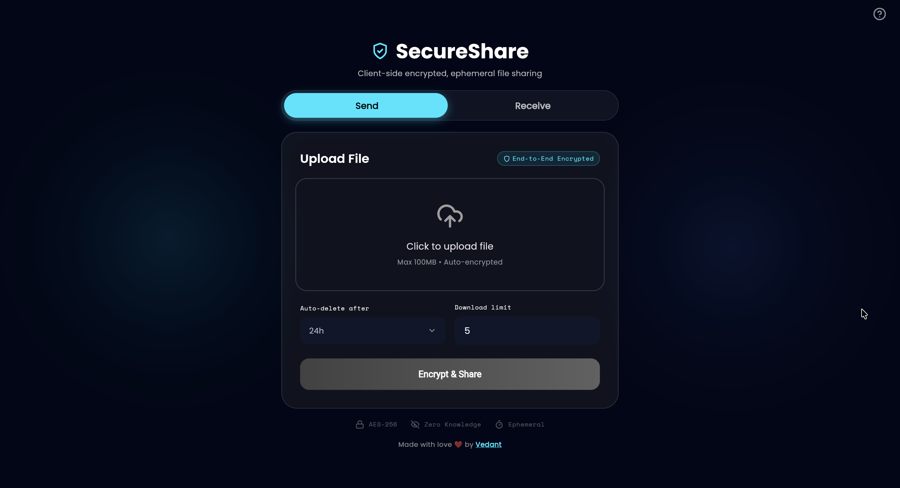

# Secure Share

Secure Share is a **Zero Knowledge** web app where users upload a file, get a one-time link, and the file is encrypted in the browser before it ever touches your server

SecureShare is a high-security web application designed for the safe, anonymous transfer of sensitive digital assets (such as API keys, certificates, and legal documents). It addresses the "Secret Distribution Problem" by replacing insecure channels like Slack or Email with an ephemeral, zero-knowledge transfer protocol.

Unlike traditional cloud storage, SecureShare operates on a Zero-Trust model: the server acts solely as a blind storage medium and never possesses the decryption keys required to read the uploaded file

---



## Core Principles

- **Zero Knowledge**
  Encryption & decryption happen in the frontend only.
  The backend never has access to user keys.

- **Ephemeral Sharing**
  Files self-destruct based on: (Burn-on-Read)

  - Time-to-Live (TTL)
  - Download limit

- **Minimal Backend State**

  - Encrypted blobs → S3 / MinIO
  - Metadata & counters → Redis

---

## Architecture Overview

### Upload Flow

1. Frontend encrypts the file using a randomly generated key.
2. Encrypted blob is uploaded to backend.
3. Backend:

   - Stores encrypted blob in S3
   - Stores metadata & download limits in Redis

4. Backend returns a `fileID`.
5. Frontend generates a shareable link:

   ```
   https://domain/download/<fileID>#<encryption_key>
   ```

### Download Flow

1. Receiver opens the link.
2. Backend validates:

   - Metadata exists
   - Download limit (if any) not exceeded

3. Backend streams encrypted blob.
4. Frontend decrypts locally using the key in URL fragment.
5. When download limit reaches zero:

   - Redis metadata is deleted
   - Encrypted blob is deleted from S3

---

## Tech Stack

### Backend

- Go
- Gin – HTTP framework
- Redis – TTL & download limits
- MinIO / AWS S3 – Encrypted blob storage

### Frontend

- Flutter (Dreamflow)


### Infrastructure

- Docker & Docker Compose
- Redis
- MinIO

---

## Project Structure

```
secure-share/
├── backend/
│   ├── cmd/server/
│   │   └── main.go
│   ├── internal/
│   │   ├── config/        # Env & config loading
│   │   ├── handlers/      # Upload / Download handlers
│   │   ├── database/      # Redis helpers
│   │   ├── storage/       # S3 / MinIO helpers
│   │   └── helper/        # Shared utilities
│   └── Dockerfile
│
├── docker-compose.yml
├── .env
└── README.md
```

---

## Running the Project

From the project root (`secure-share/`):

```bash
docker compose up -d
```

This starts:

- Redis
- MinIO (S3-compatible storage)
- Backend API

Backend will be available at:

```
http://localhost:8080
```

---

### Notes

- Ensure `.env` is configured correctly before running
- MinIO runs on `http://localhost:9000`
- Redis runs on `localhost:6379`
- Backend expects both services to be reachable

## API Endpoints

### Health Check

```
GET /
```

### Upload File

```
POST /upload
```

**Form Data**

- `file` (required) → encrypted file
- `filename` (required)
- `ttl` (optional) → expiry in hours
- `download_limit` (optional)

### Download File

```
GET /download/:fileID
```

> The decryption key is **never sent to the backend**.
> It lives in the URL fragment (`#key`) and is used only by the frontend.

---

## Redis Data Model

| Key              | Type          | Purpose             |
| ---------------- | ------------- | ------------------- |
| `meta:<fileID>`  | string (JSON) | File metadata       |
| `limit:<fileID>` | string (int)  | Remaining downloads |

Redis TTL controls expiration automatically.

---

## Cleanup Rules

- **Download limit reached (`0`)**

  - Redis metadata deleted
  - Encrypted blob deleted from S3

- **TTL expired**

  - Redis keys auto-expire
  - S3 cleanup handled later via lifecycle or background job

---

## Security Notes

- Backend never sees encryption keys
- Files are useless without the client-held key
- Redis stores only non-sensitive metadata
- URL fragments are never sent to servers

---
